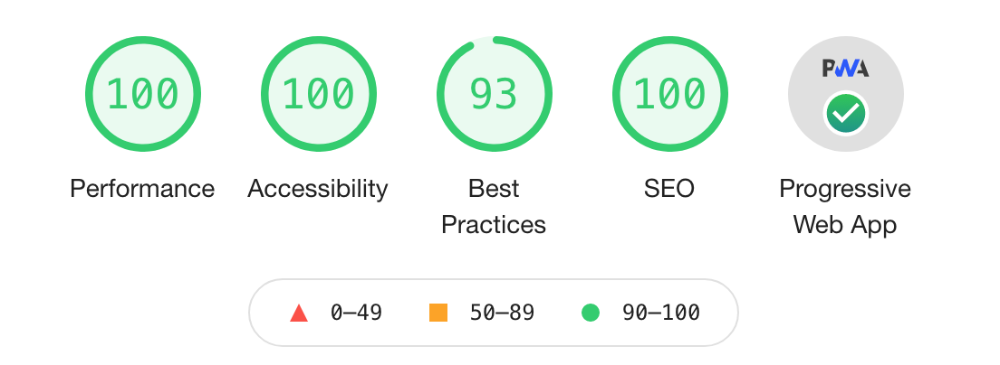
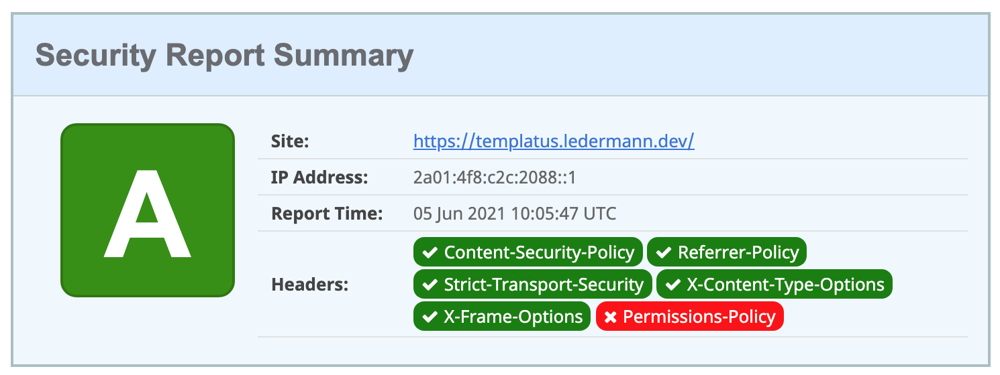

# README

Templatus is an opinionated template for web applications with Ruby on Rails using Vue.js on the frontend. It simplifies the process of setting up a new application while following best practices.

Live demo available at https://templatus.ledermann.dev

## Technology stack

- Ruby 3
- Ruby on Rails 6.1
- Webpacker 6 (still in beta, but this allows using Webpack 5)
- ActionCable (for WebSocket communication)
- PostgreSQL (for using as SQL database)
- Redis (for Caching and ActionCable)
- Vue 3 (as frontend framework)
- Vue Router (for frontend routing)
- Vuex (for frontend state management)
- Tailwind CSS 2 (to not have to write CSS at all)
- HeadlessUI (unstyled, fully accessible UI components designed to integrate with Tailwind CSS)
- HeroIcons (for SVG icons as Vue components)
- RSpec (for Ruby testing)
- RuboCop (for Ruby static code analysis)
- TypeScript (for writing better JavaScript)
- Jest (for JavaScript testing)
- Sentry (for error tracking in Ruby and JavaScript)
- Lograge (for single-line logging)
- Docker (for production deployment, NOT for development)
- Puma-dev (for using https in development)
- Foreman (for starting up the application locally)
- dotenv (for configuration by using ENV variables)

## Features

- Deployment using an [optimized Alpine-based Docker image](https://github.com/ledermann/docker-rails-base)
- Ready for serving assets via CDN like CloudFront
- Ready for PWA (manifest, service-worker)
- Gzip compression of all dynamic responses using Rack::Deflater
- JS Code splitting (separate vendor code from own code)
- Fine-tuned Content Security Policy (CSP)
- Uses GitHub Actions for testing, linting and building Docker image
- Visual Studio Code: Autoformat JS and Ruby code using Prettier

## Metrics

### Lighthouse site performance

100% in nearly all categories.



Why not 100% in "Best practice" category? This is a bug in Lighthouse, because Lighthouse first injects inline styles and then whines about a CSP warning. See https://github.com/GoogleChrome/lighthouse/issues/11862

### Network transfer

Small footprint: Only 74Kb transfer in total for the first visit


### Secure headers



https://securityheaders.com/?q=templatus.ledermann.dev&followRedirects=on

### Mozilla Observatory


https://observatory.mozilla.org/analyze/templatus.ledermann.dev

### JavaScript size

196 KB of compiled JavaScript (minified, uncompressed). The biggest parts are Sentry (74KB) and Vue.js (50KB).

```
RAILS_ENV=production bin/rails webpacker:clobber webpacker:compile
Compiling...
Compiled all packs in /Users/ledermann/Projects/templatus/public/packs

warn - You have enabled the JIT engine which is currently in preview.
warn - Preview features are not covered by semver, may introduce breaking changes, and can change at any time.

assets by path media/images/ 52.6 KiB
  assets by chunk 47.7 KiB (auxiliary name: application) 9 assets
  assets by path media/images/*.gz 2.64 KiB 3 assets
  assets by path media/images/*.br 2.25 KiB
    asset media/images/ef0c1c6c92c1b5e887fc.ico.br 1.25 KiB [emitted] [immutable] [compressed]
    asset media/images/bcb6d75d927347158af5.svg.br 796 bytes [emitted] [immutable] [compressed]
    asset media/images/f04dfe30a8ad8eb5c4e0.svg.br 224 bytes [emitted] [immutable] [compressed]
assets by path js/*.js 196 KiB
  asset js/637-23fc48f7d24a4a343687.js 178 KiB [emitted] [immutable] [minimized] (id hint: vendors) 4 related assets
  asset js/application-32e37410471a4c94fa38.js 16.6 KiB [emitted] [immutable] [minimized] (name: application) 3 related assets
  asset js/runtime-65623d96786f79cdfa20.js 1.67 KiB [emitted] [immutable] [minimized] (name: runtime) 3 related assets
asset css/application-8e7bda08.css 16.8 KiB [emitted] [immutable] [minimized] (name: application) 3 related assets
asset manifest.json 3.79 KiB [emitted] 2 related assets
Entrypoint application 213 KiB (342 KiB) = js/runtime-65623d96786f79cdfa20.js 1.67 KiB js/637-23fc48f7d24a4a343687.js 178 KiB css/application-8e7bda08.css 16.8 KiB js/application-32e37410471a4c94fa38.js 16.6 KiB 13 auxiliary assets
orphan modules 473 KiB [orphan] 357 modules
runtime modules 3.7 KiB 8 modules
code generated modules 958 KiB (javascript) 47.7 KiB (asset) 26.1 KiB (css/mini-extract) [code generated]
  javascript modules 957 KiB
    modules by path ./node_modules/ 927 KiB 8 modules
    modules by path ./app/packs/ 30.4 KiB
      ./app/packs/entrypoints/application.ts + 43 modules 30.1 KiB [built] [code generated]
      ./app/packs/images/ sync ^\.\/.*$ 378 bytes [built] [code generated]
  asset modules 378 bytes (javascript) 47.7 KiB (asset)
    optional modules 294 bytes (javascript) 45.4 KiB (asset) [optional] 7 modules
    modules by path ./app/packs/images/*.svg 84 bytes (javascript) 2.33 KiB (asset)
      ./app/packs/images/rails.svg 42 bytes (javascript) 1.96 KiB (asset) [built] [code generated]
      ./app/packs/images/vue.svg 42 bytes (javascript) 375 bytes (asset) [built] [code generated]
  css ./node_modules/css-loader/dist/cjs.js??clonedRuleSet-3.use[1]!./node_modules/postcss-loader/dist/cjs.js??clonedRuleSet-3.use[2]!./app/packs/stylesheets/application.css 26.1 KiB [code generated]
webpack 5.38.1 compiled successfully in 6958 ms
```

### Docker build time

About 1,5 minutes on GitHub Actions (see https://github.com/ledermann/templatus/actions)

### Docker image size

107 MB (uncompressed)

```
REPOSITORY                     TAG       IMAGE ID       CREATED       SIZE
ghcr.io/ledermann/templatus   latest    7f5a3f2b63d6   2 hours ago   107MB
```

## Installation

1. Clone the repo locally:

```bash
git clone git@github.com:ledermann/templatus.git
cd templatus
```

2. Install PostgreSQL, Redis and puma-dev (if not already present). On a Mac with HomeBrew, run this to install from the `Brewfile`:

```bash
brew bundle
```

3. Install and set up [puma-dev](https://github.com/puma/puma-dev) to use HTTPS for both the application and `webpack-dev-server`. Do this on macOS:

```bash
sudo puma-dev -setup
puma-dev -install
puma-dev link

# Use https in development and load webpack from subdomain
# https://github.com/puma/puma-dev#webpack-dev-server
echo 3035 > ~/.puma-dev/webpack.templatus
```

4. Setup the application to install gems and NPM packages and create the database:

```bash
bin/setup
```

5. Start the application (and webpack-dev-server) locally:

```bash
foreman start
```

Then you can open https://templatus.test in your browser.

## Test

Run Ruby tests:

```
bin/rspec
open coverage/index.html
```

Run RuboCop:

```
bin/rubocop
```

Lint JavaScript:

```
bin/yarn lint
```

Run JavaScript tests:

```
bin/yarn test
```
